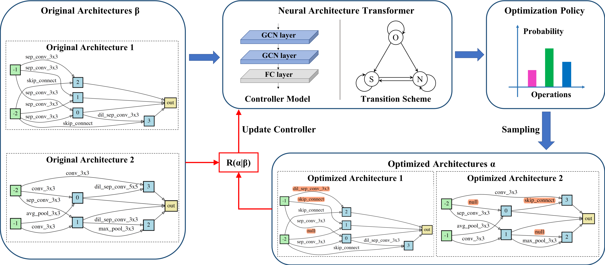
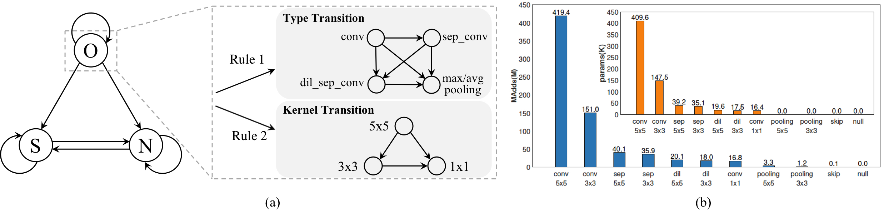
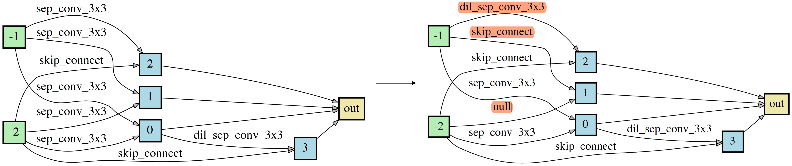

# Towards Accurate and Compact Architectures via Neural Architecture Transformer

Pytorch implementation for “Towards Accurate and Compact Architectures via Neural Architecture Transformer”.

<p align="center">

</p>
<p align="aligned">
Figure. The scheme of NATv2. Our NATv2 takes an arbitrary architecture as input and produces the optimized architecture as the output. We use blue arrows to represent the process of architecture optimization. Red arrows and boxes denote the computation of reward and gradients. $R(\alpha | \beta)$ denotes the reward that measures the performance improvement between two architectures $\alpha$ and $\beta$.
</p>


## Operation Transition Scheme of NATv2

<p align="center">

</p>
<p align="aligned">
Figure. Operation transition scheme of NATv2. (a) operation transition of NATv2; (b) computation costs of different operations. We set the input channel and output channel to 128, the height and width of the input feature maps to 32. Here, sep denotes a separable convolution and dil denotes a dilated separable convolution..
</p>

## Requirements

```
Python>=3.6, PyTorch==0.4.0, torchvision==0.2.1 graphviz=0.10.1 scipy=1.1.0 pygcn
```

Please follow the [guide](https://github.com/tkipf/pygcn) to install pygcn.

## Datasets
We consider two benchmark classification datsets, including CIFAR-10 and ImageNet.

CIFAR-10 can be automatically downloaded by torchvision.

ImageNet needs to be manually downloaded (preferably to a SSD) following the instructions [here](https://github.com/pytorch/examples/tree/master/imagenet).

## Training Method

We consider to optimize two kinds of architectures, namely loose-end architectures and fully-concat architectures. More details about these two kinds of architectures can be found in [ENAS](https://arxiv.org/abs/1802.03268) and [DARTS](https://arxiv.org/abs/1806.09055), respectively.

Train NAT for fully-concat architectures.
```
python train_search.py --data $DATA_DIR$ --op_type FULLY_CONCAT_PRIMITIVES
```

Train NAT for loose-end architectures.
```
python train_search.py --data $DATA_DIR$ --op_type LOOSE_END_PRIMITIVES
```

## Inference Method

### 1. Put the input architectures in [genotypes.py](./genotypes.py) as follows

```
DARTS = Genotype(
    normal=[('sep_conv_3x3', 0, 2), ('sep_conv_3x3', 1, 2), ('sep_conv_3x3', 0, 3), ('sep_conv_3x3', 1, 3), ('sep_conv_3x3', 1, 4),
            ('skip_connect', 0, 4), ('skip_connect', 0, 5), ('dil_conv_3x3', 2, 5)], normal_concat=[2, 3, 4, 5],
    reduce=[('max_pool_3x3', 0, 2), ('max_pool_3x3', 1, 2), ('skip_connect', 2, 3), ('max_pool_3x3', 1, 3), ('max_pool_3x3', 0, 4),
            ('skip_connect', 2, 4), ('skip_connect', 2, 5), ('max_pool_3x3', 1, 5)], reduce_concat=[2, 3, 4, 5])
```


### 2. Feed an architecture into the transformer and obtain the transformed architecture

You can obtain the transformed architecture by taking an architecture as input, *e.g.*, --arch DARTS.  


```
python derive.py --data ./data --arch DARTS --model_path pretrained/fully_connect.pt
```

<p align="center">

</p>
<p align="aligned">
Figure. An example of architecture transformation of NATv2.
</p>

## Architecture Visualization

You can visualize both the input and the transformed architectures by
```
python visualize.py some_arch
```
where `some_arch` should be replaced by any architecture in [genotypes.py](./genotypes.py).


